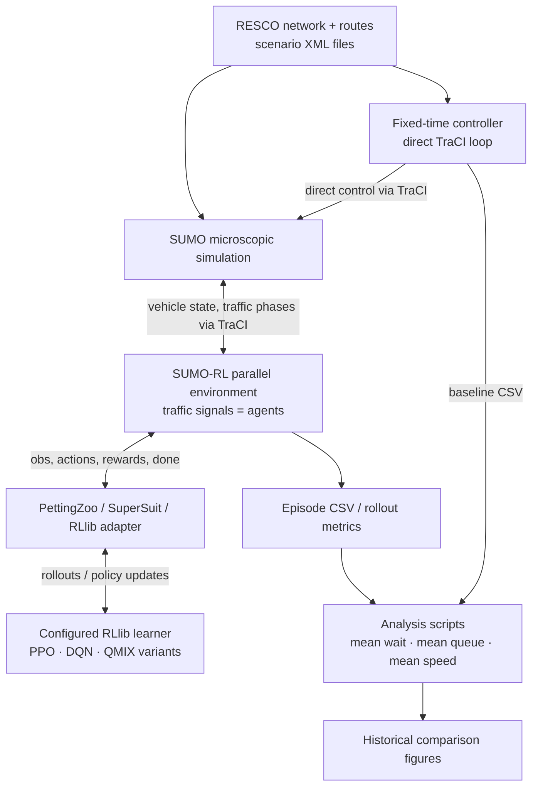
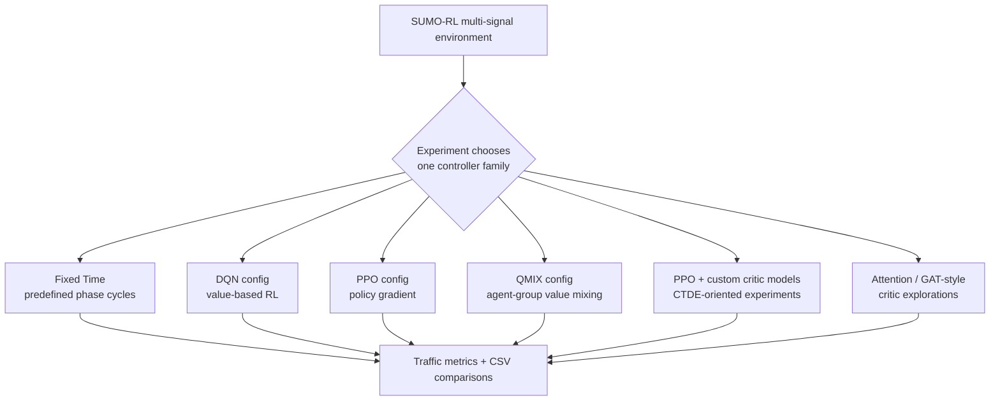

# SUMO_MARL — System Design

> **Multi-agent reinforcement learning for traffic-signal control in simulated urban road networks.**
>
> [Project overview](../README.md) · [Italian architecture walkthrough and interview guide](PROJECT_WALKTHROUGH_IT.md)

## 1. Motivation: why traffic control, and why multiple agents?

Traffic-light timing is a **sequential decision problem**: a signal chooses which traffic phase to serve now, but that decision changes future queues and vehicle movement. In a network of intersections, those decisions are coupled. Releasing a platoon of vehicles from one intersection can influence congestion downstream; optimizing a junction in isolation does not automatically optimize a whole corridor.

The project's central question is:

**How do different learning and coordination approaches behave when we move from one controlled traffic signal to interconnected networks with different levels of congestion?**

The study therefore compares a **fixed-time reference controller** with multiple reinforcement-learning families, rather than treating reinforcement learning as guaranteed to outperform traditional control.

### Research goals

- Run comparable **traffic-light controllers** in microscopic traffic simulation.
- Investigate independent-policy approaches, value decomposition, and *centralized-training / decentralized-execution (CTDE)* ideas.
- Explore whether critic architectures using attention or traffic-network context are useful in multi-intersection scenarios.
- Evaluate network behavior using **waiting time, queue length and mean vehicle speed**.
- Analyze changes across RESCO-inspired Cologne and Ingolstadt scenarios.

**Boundary:** the repository contains experiment scripts and historical plots. It is a **research prototype**, not a deployable real-city traffic controller or a completely reproduced, statistically conclusive benchmark.

## 2. System context

**SUMO** simulates vehicles and their interactions with the road network. **TraCI** lets Python interact with the simulator. The MARL scripts use **SUMO-RL**, which presents signals as agents in a PettingZoo-style multi-agent environment; **RLlib** performs rollouts and training.



The fixed-time path is **separate** from the learned-agent path. The former sets traffic-light phases directly through TraCI; the latter uses SUMO-RL and RLlib.

**Crucial setup dependency:** the scripts reference `nets/RESCO/<scenario>/*.net.xml` and `*.rou.xml` under the repository root, but **the entire `nets/` tree is absent from this repository**. A clone alone therefore cannot run the included SUMO experiments.

## 3. Agent interaction: what is observed and controlled?

The core SUMO-RL experiment configuration appears repeatedly:

```python
env = sumo_rl.parallel_env(
    net_file=NET_FILE,
    route_file=ROUTE_FILE,
    num_seconds=3600,
    delta_time=10,
    yellow_time=3,
    min_green=5,
    max_green=60,
    reward_fn="diff-waiting-time",
    use_gui=False,
)
```

- **Agent:** a traffic-signal controller in the simulated network.
- **Observation:** a local vector produced by SUMO-RL's observation function. The repository does not redefine a single canonical observation formula across all scripts; detailed fields and dimensions depend on the installed SUMO-RL version and scenario.
- **Action:** a discrete signal-phase choice routed through the SUMO-RL environment (distinct from the direct phase control of fixed-time scripts).
- **Reward:** the configured `diff-waiting-time` reward, a change-based training signal linked to waiting time. It is **not identical** to the mean waiting-time metric reported in the final analysis.
- **Decision interval:** `delta_time=10` simulation seconds in the inspected experiment scripts, with signal switching constraints such as yellow and minimum/maximum green periods.
- **Episode:** typically 3,600 simulated seconds, with scenario-specific `begin_time`.

The implementation often uses `ParallelPettingZooEnv` and (in selected scripts) SuperSuit observation/action padding. For QMIX, a grouped agent interface is explicitly constructed.

## 4. Coordination strategies: alternatives, not a single processing chain



The arms are **different scripts/configurations**. They are not multiple agents jointly training as one ensemble during a single simulation.

| Family | Conceptual reason to compare | Repository implementation and limitation |
| --- | --- | --- |
| Fixed-time | Transparent no-learning reference | `run_fixed_time.py` directly configures phase cycles through TraCI; multi-signal scripts implement their own phase scheduling |
| IDQN-labelled | Value-based independent decision-making | RLlib `DQNConfig` with a policy named `shared`; **parameter sharing means the code is not evidence of one separate Q-network per intersection** |
| IPPO-labelled | Policy gradient without an explicit centralized critic | RLlib `PPOConfig` and `shared` policy mapping; the code does not prove independently parameterized per-agent policies |
| QMIX | Explore centralized value mixing with grouped agents | RLlib `QMixConfig` and `with_agent_groups`; depends on legacy RLlib interfaces and version compatibility |
| MAPPO-labelled | Explore CTDE with a critic informed by more than local observations | PPO with custom critic class registration. **A critic class alone does not prove that all-agent observations are collected and used in the loss** |
| Attention critic | Weight information from different signal observations | Custom model includes `nn.MultiheadAttention` in `forward_critic`, but the runner does not visibly implement the end-to-end data wiring required to verify its use |
| GAT-style critic | Represent cross-agent interactions through an attention layer | Uses a multi-head self-attention block over reshaped agent vectors; **not a topology-aware message-passing GAT implementation with explicit graph edges** |
| Temporal variant | Investigate short history windows | The `resco_ingolstadt1/lstm_mappo` script stacks recent observations; its registered “GAT temporal critic” is an MLP policy/value model, **not visibly an LSTM or graph-attention network** |

The distinction is intentional: **algorithm labels are hypotheses and names of experiment files, not proof of implemented CTDE or topology-aware attention**. Those behaviors must be traced end-to-end through rollout view requirements, critic inputs, value-function calls and PPO loss integration before making stronger claims.

### Where the critic integration deserves particular scrutiny

Custom `CentralizedCriticModel` / attention classes expose `forward_critic(critic_obs)`. Their ordinary `forward()` primarily returns actor logits, and `value_function()` returns a cached value or an initial zero. In the inspected runner, no explicit postprocessing callback is shown that computes global `critic_obs` or calls `forward_critic` for each training batch.

Consequently, the current code is **CTDE-oriented experimentation**, not a demonstrated correct MAPPO implementation. It is a specific technical improvement opportunity, not a reason to suppress the research work.

## 5. Experiment scenarios

Five folders are tracked:

| Scenario folder | Code organization | Intended network scale |
| --- | --- | --- |
| [`cologne1`](../experiments/cologne1/) | Fixed-time, IDQN, IPPO, QMIX, MAPPO and critic variants | Single-signal label |
| [`cologne3`](../experiments/cologne3/) | Same families, extended analysis | Three-signal label |
| [`resco_ingolstadt1`](../experiments/resco_ingolstadt1/) | Multiple RL families plus a temporal-window experiment | Single-signal label |
| [`resco_ingolstadt7`](../experiments/resco_ingolstadt7/) | Multi-signal controllers, attention/GAT-style variants | Seven-signal label |
| [`resco_ingolstadt21`](../experiments/resco_ingolstadt21/) | Multi-signal experiments and comparisons; some algorithms absent | Twenty-one-signal label |

The numbers are **scenario naming conventions**, not counts dynamically revalidated here. The actual intersection IDs, topology and route traffic are external to this tracked repository.

Each scenario includes some combination of:
- `run_fixed_time.py`, `run_idqn.py`, `run_ippo.py` and `run_qmix.py`;
- `mappo_env/`, `mappo_env_att/` and `gat_mappo/` custom PPO experiments;
- scripts for inspecting network demand and for plotting comparisons.

Not all variants appear in all five scenarios, and several scripts retain copy-pasted console labels from other scenarios. Describe the **actual folder and configuration**, not just a log banner.

## 6. Data products and evaluation

Historical plots are committed (for example [waiting-time trends in Ingolstadt7](../experiments/resco_ingolstadt7/global_mean_wait.png), [scenario comparison](../experiments/resco_ingolstadt7/best_performance_comparison.png), and [Cologne3 waiting-time trends](../experiments/cologne3/curve_mean_wait.png)).

Reported traffic metrics include:

| Metric | Interpretation | Desired direction |
| --- | --- | --- |
| `mean_wait` | Average observed waiting-time measurement from the selected run | Lower |
| `mean_queue` | Queue/stopped-vehicle measurement | Lower |
| `mean_speed` | Average vehicle speed | Higher, interpreted with congestion and safety constraints |

**Do not confuse training reward with evaluation.** The reward is `diff-waiting-time`, while metrics are assembled from SUMO and TraCI outputs.

### Important comparison limitations

The analysis scripts scan saved episode CSVs and frequently select the **best eligible episode by minimum mean waiting time** (e.g. `compare.py` and `training_full.py`) rather than scoring a frozen checkpoint on independent held-out seeds. Best-of-training selection produces **optimistic estimates** if presented as generalization performance.

Additionally, fixed-time scripts sometimes compute waiting time from vehicle-level values and sometimes from edge-level values, and may advance multiple signals using a duration chosen from one reference signal. Without a common measurement and execution contract, comparisons should be called **historical exploratory comparisons**, not tightly controlled head-to-head evidence.

The repository does not track the raw simulation CSV rollouts or a complete report of seeds, versions, trajectories and checkpoint identifiers. PNG plots alone do not justify invented numerical win percentages or claims of statistical significance.

## 7. Design motivations and trade-offs

| Design decision | Why consider it? | Cost / risk |
| --- | --- | --- |
| SUMO microscopic simulation | Test adaptive signal control without real-world traffic intervention | Performance depends on routes, simulator fidelity, and network configuration |
| SUMO-RL + PettingZoo | Expose intersections as interacting RL agents | Environment and wrapper compatibility depend on library versions |
| Ray RLlib | Compare established deep-RL training configurations and parallel rollouts | High version sensitivity and process/TraCI resource complexity |
| Shared policy mapping | Reduce training complexity; allow policy sharing across signals | Not the same as independent, separately trained actors |
| QMIX | Explore the effect of mixing individual action values into a joint estimate | Requires grouped joint-agent trajectories and supported RLlib algorithm APIs |
| Attention-based value functions | Study whether combining intersection information could help value estimation | Must really pass multi-agent observations to critic and train it |
| Fixed-time baseline | Compare adaptive learning against a known non-learning policy | Phase constraints and metric collection must be harmonized |
| Multi-scenario coverage | Study changes with network complexity and congestion | Need consistent evaluation and more than one randomized rollout |

## 8. Reproducibility and technical debt

- **Missing network inputs:** `nets/RESCO/` XML files are not in Git; SUMO scripts cannot be reproduced by cloning alone.
- **Version compatibility:** `requirements.txt` is unpinned; the code uses RLlib legacy APIs including `.rollouts()`, `TorchModelV2`, `ModelCatalog` and `ray.rllib.algorithms.qmix`. Reproduction depends on a compatible version matrix.
- **Centralized-critic evidence:** additional wiring and tests are needed to prove centralized training is actually occurring, including the correct critic inputs and gradient flow.
- **Parallel execution:** separate SUMO instances and unique TraCI ports/output paths need validation across workers. Several scripts delete their output directories when imported.
- **Evaluation:** “best episode” selection, potentially inconsistent metric collection, and source-specific fixed-time phase scheduling require a normalized protocol.
- **Artifacts:** raw CSVs, training checkpoints, traffic network XML files and full run manifests are not present in the repository.
- **No full integration validation:** this documentation does **not** claim to have run SUMO, RLlib training or a complete scenario replay.

### Priority improvements

1. Restore documented legal sources and versions for RESCO network/route XML, without publishing third-party assets without permission.
2. Freeze dependency versions and document SUMO, Python, RLlib, SUMO-RL and OS configuration.
3. Extract and test a shared scenario/metric contract, with a consistent definition of waiting/queue/speed.
4. Verify actual CTDE wiring and correct policy/critic gradient flows; rename variants where necessary.
5. Evaluate frozen checkpoints on **held-out seeds**, alternating stochastic traffic inputs and reporting mean ± variation.
6. Compare with fixed-time under identical episodes and rollout measurement criteria; keep best-training plots as diagnostics.

## 9. Code map

- [Experiments by scenario](../experiments/)
- [Fixed-time reference — Cologne1](../experiments/cologne1/run_fixed_time.py)
- [DQN/PPO independent-labelled scripts](../experiments/cologne1/run_idqn.py) · [IPPO](../experiments/cologne1/run_ippo.py)
- [QMIX grouping example](../experiments/resco_ingolstadt7/run_qmix.py)
- [PPO / “MAPPO” runner](../experiments/resco_ingolstadt7/mappo_env/run_mappo.py)
- [Custom centralized critic class](../experiments/resco_ingolstadt7/mappo_env/centralized_critic.py)
- [Attention critic](../experiments/resco_ingolstadt7/mappo_env_att/centralized_critic_attention.py)
- [GAT-style critic](../experiments/resco_ingolstadt7/gat_mappo/gat_critic.py)
- [Temporal-stack experiment](../experiments/resco_ingolstadt1/lstm_mappo/run_mappo.py)
- [Comparison aggregation](../experiments/resco_ingolstadt7/compare.py) · [Training curves](../experiments/resco_ingolstadt7/training_full.py)

**Design takeaway:** controlling one junction is a local sequential problem; coordinating several junctions is a coupled multi-agent problem. The repository explores a spectrum of solutions and shows why **correct experiment design and training data flow matter as much as algorithm choice**.
